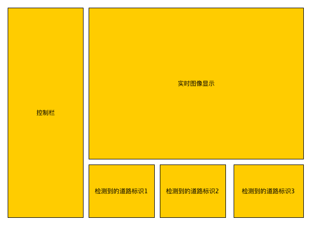

《机器视觉》课程设计说明

刘文果

1.  **课程设计任务**

据调查，道路交通事故中有 1/3
是由车辆变道或车辆偏离其正常行驶车道区域所导致的。美国联邦公路局的研究表明：如果可以获得车辆与车道之间的相对位置信息，则可以防止
53%左右的车道偏离事故，因此针对路面标线检测的研究是实现车道偏离警告系统的关键技术，其对于实现车辆的完全自主驾驶具有深远的意义。在此背景下，本课程的课程设计任务为：

**[利用OpenCV库和其他开源工具，实现车道线和道路标示牌的实时检测]{.underline}**

系统的基本功能要求如下：

1.  利用C/C++代码实现，用git进行版本管理，代码提交应该包含有开发日志（git提交日志）。

2.  测试和验证视频样本由老师提供，也可自行采集，自行采集的应该包括至少两类目标：明显的道路线和一定数量的道路标识牌。

3.  提供比较友好的用户接口，可以由用户自行加载不同的视频。应该包含合适的输出界面，将结果呈现给用户。

4.  检测流程应该包括"道路预处理车道线特征提取车道线检测"

5.  检测后的结果应该能实时输出，例如：检测到的车道线实时与视频显示在同一窗口。

6.  实时检测出视频中的道路标识，从视频中把道路标识分割出来，并显示在窗口中。

7.  界面实现可以参考下图，也可以按照自己的方式实现。

> {width="4.208333333333333in"
> height="3.0416666666666665in"}

a)  参考资料

<!-- -->

1.  OpenCV官方参考文档

2.  Github网站

[[https://github.com/tatsuyah/Lane-Lines-Detection-Python-OpenCV]{.underline}](https://github.com/tatsuyah/Lane-Lines-Detection-Python-OpenCV)

[[https://github.com/naokishibuya/car-finding-lane-lines]{.underline}](https://github.com/naokishibuya/car-finding-lane-lines)

[[https://github.com/georgesung/advanced\_lane\_detection]{.underline}](https://github.com/georgesung/advanced_lane_detection)

[[https://github.com/DavidAwad/Lane-Detection]{.underline}](https://github.com/DavidAwad/Lane-Detection)

[[http://www.transistor.io/revisiting-lane-detection-using-opencv.html]{.underline}](http://www.transistor.io/revisiting-lane-detection-using-opencv.html)

2.  **考察方式及内容**

<!-- -->

1.  按时提交课程设计报告（纸质版），并上传电子版和所有代码（压缩并命名为"学号\_姓名.zip"到FTP服务器，时间:上机考核当天。

2.  上机考核，学生自带电脑，设置好程序运行环境，按照课程设计任务的基本功能要求进行功能测试，第18周，办公室8A405，周日，9-11节。

<!-- -->

3.  **评分标准**

> 课程设计报告（30%）
>
> 代码功能完善（70%）
